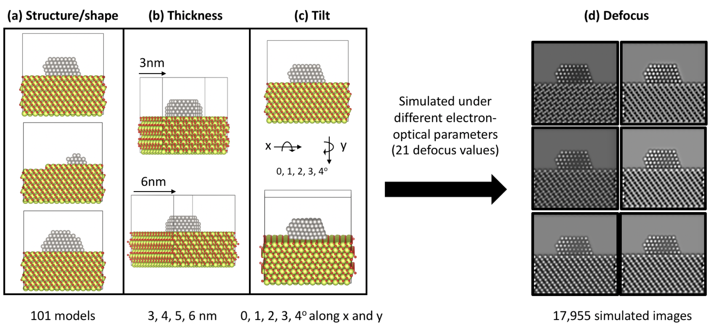
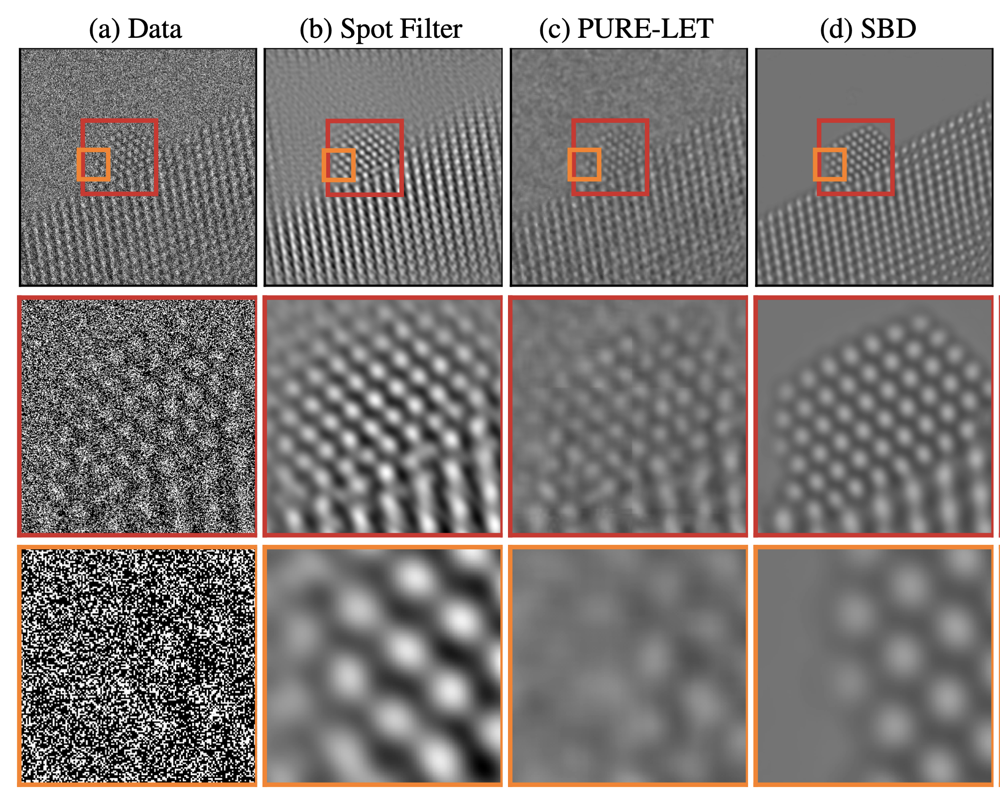
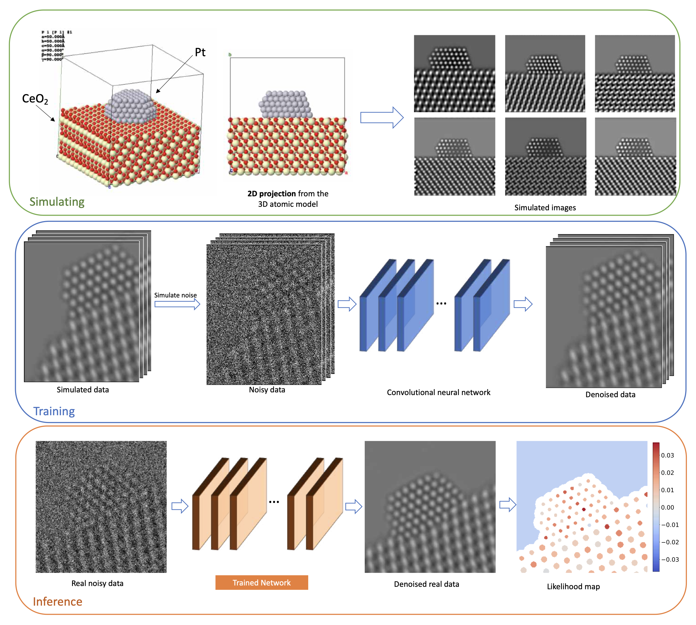
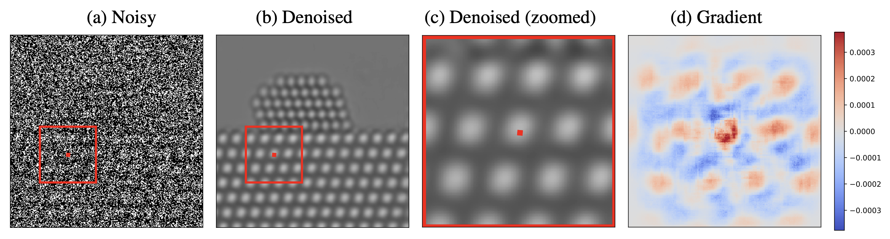
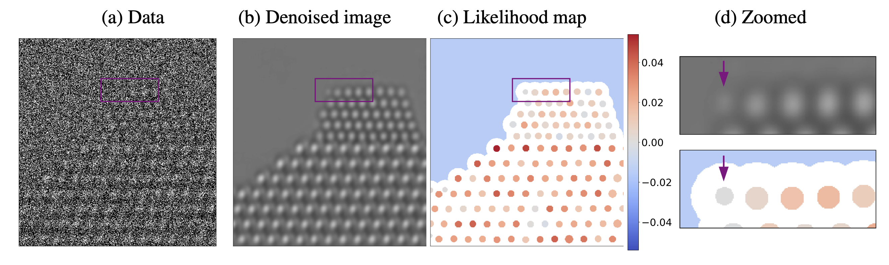

This website contains code, models and dataset from the paper [Deep Denoising for Scientific Discovery: A Case Study in Electron Microscopy](https://openreview.net/pdf?id=TRgh1LjcBvt) by [Sreyas Mohan](https://sreyas-mohan.github.io), [Ramon Manzorro](https://crozier.engineering.asu.edu/ramon-manzorro/), [Joshua Vincent](https://crozier.engineering.asu.edu/people/current-graduate-students/josh-vincent/),  [Binh Tang](https://www.linkedin.com/in/binh-tang-3b76557b/), [Dev Sheth](https://www.linkedin.com/in/dev-sheth/), [Eero P Simoncelli](https://www.cns.nyu.edu/~eero/), [David S Matteson](https://davidsmatteson.com), [Peter A Crozier](https://crozier.engineering.asu.edu/people/peter-a-crozier/) and [Carlos Fernandez-Granda](https://cims.nyu.edu/~cfgranda/)

Denoising is a fundamental challenge in scientific imaging. Deep convolutional neural networks (CNNs) provide the current state of the art in denoising natural images, where they produce impressive results. However, their potential has barely been explored in the context of scientific imaging. Denoising CNNs are typically trained on real natural images artificially corrupted with simulated noise. In contrast, in scientific applications, noiseless ground-truth images are usually not available. To address this issue, we propose a simulation-based denoising (SBD) framework, in which CNNs are trained on simulated images. We test the framework on data obtained from transmission electron microscopy (TEM), an imaging technique with widespread applications in material science, biology, and medicine. SBD outperforms existing techniques by a wide margin on a simulated benchmark dataset, as well as on real data. Apart from the denoised images, SBD generates likelihood maps to visualize the agreement between the structure of the denoised image and the observed data. Our results reveal shortcomings of state-of-the-art denoising architectures, such as their small field-of-view. Through a gradient-based analysis, we show that substantially increasing the field-of-view of the CNNs allows them to exploit non-local periodic patterns in the data, which is crucial at high noise levels. In addition, we perform a thorough analysis of the generalization capability of SBD, demonstrating that the trained networks are robust to variations of imaging parameters and of the underlying signal structure. Finally, we release the first publicly available benchmark dataset of TEM images, containing 18,000 examples.

## Dataset
 
**Summary of parameters considered during the modelling and image simulation processes.** Subset of Pt/CeO2 atomic models presenting variations on the (a) structure and shape of the nanoparticle and the support, (b) the thickness of the CeO2 slab and (c) the tilt of the atomic models. Color code for the models matches Pt, Ce and O with grey, yellow and red atoms respectively. (d) Simulated images under different defocus values.

Please visit [our github page](https://github.com/sreyas-mohan/electron-microscopy-denoising) for instructions to download the dataset.

## Results

 
**Denoising results for real data** (a) An atomic-resolution electron-microscope image of a platinum nanoparticle obtained via transmission electron microscopy at a magnification of over one million. The average image intensity is 0.45 electrons/pixel (i.e. a large fraction of pixels represent zero electrons!), which results in a very low signal-to-noise ratio. (b) The denoised image obtained via Fourier-based filtering by a domain expert has very strong periodic artifacts. (c) The denoised image obtained via the wavelet-based PURE-LET method does not recover the surface of the nanoparticle. (d) In contrast, the denoised image obtained by our method restores the surface structure of the nanoparticle without adding periodic artifacts.

## Simulation Based Denoising Framework

 
**Simulation-based denoising framework**. (Top) A training dataset is generated by simulating images with different structures at varying imaging conditions. (Middle) A CNN is trained using the simulated images, paired with noisy counterparts obtained by simulating the relevant noise process. (Bottom) The trained CNN is applied to real data to yield a denoised image. After analyzing the image to extract structure of interest, a likelihood map is generated to quantify the agreement between this structure and the noisy data.

## Interpretability

 
**Interpretability via Gradient Visualization.**  The proposed methodology provides an interpretable visualization based on the gradient of the deep neural network used for noise reduction. Image (a) shows the noisy data. Image (b) shows the denoised image. Image (c) shows a zoomed depiction of the denoised image. Image (d) shows the gradient visualization, which indicates what regions in the noisy image have a greater influence on the estimate of that particular pixel. The gradient weights nearby pixels more heavily, but also has significant magnitude at pixels located on different atoms. This reveals the way in which the network combines local and non-local information to estimate the pixel.

 
**Uncertainty Quantification via Likelihood Maps.** The proposed methodology makes it possible to evaluate the consistency between the structure uncovered by the denoising process and the observed data. This is achieved by plotting a *likelihood map* corresponding to the difference in the log likelihood corresponding to two competing hypotheses about the underlying structure. In this example, we evaluate whether atomic columns are present or an artifact of the noise-reduction process. Denoising the simulated noisy image in (a) results in a spurious atom at the left edge of the nanoparticle, as shown in (b) and (d) (the spurious atom is marked with an arrow). However, the likelihood map (c) at that location is negative, which indicates that the presence of an atom is less likely than its absence according to the observed data.

## Pre-Trained Models and Code
Please visit [our github page](https://github.com/sreyas-mohan/electron-microscopy-denoising) for dataset, pre-trained models, code and instructions on how to use the code. 

